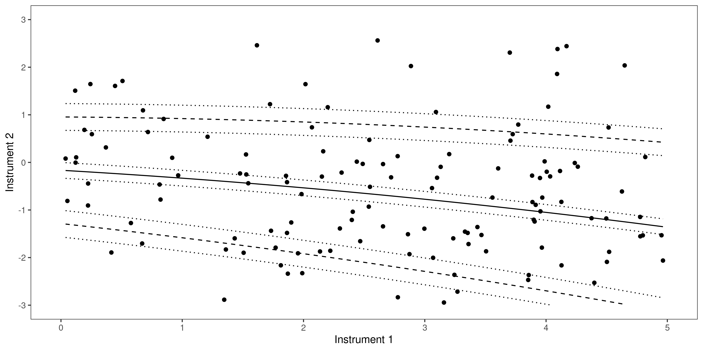

# Bland-Altman plots

This repository contains code used to analyse bias between measurements using Bland-Altman plots.

## Dependencies

This code has been tested using R version 3.6.3. This code depends on the following packages:
```
ggplot2 3.3.3
blandr 0.5.1
dplyr 1.0.4
gridExtra 2.3
ggpubr 0.4.0
```

## Analysis

The code used to produce the plots in the accompanying paper is:
```
make_plots_for_paper.R
```
This script uses a private csv file containing the data. To reuse this code for a different analysis, make the relevant adjustments to this script to use your own data.

The main functions used by this script are stored in the `R` folder.

## Example

To demonstrate the methodology we have provided a simple example using synthetic data. We create a data set of "read" value and then create two instruments to simulate observations. Both instruments apply some random variation to the real value, with a mean of zero and variance of 0.1, using the `rnorm` function. Instrument 1 adds some additional random values with a bias, by adding a random number from a uniform distribution between 0 and a value proportional to the value being measured.  Therefore, the bias gets larger for larger values of the value.

In the images below we show this data displayed on two Bland-Altman plots, one with a linear fit (upper) and one with a quadratic fit (lower). The values of the best fit parameters will be different for each run since the data is generated at random.




To repeat this exercise simple run through the script
```
example.R
```
which will produce some additional plots as you step through each line to demonstrate the method.
